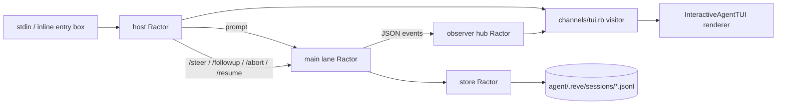
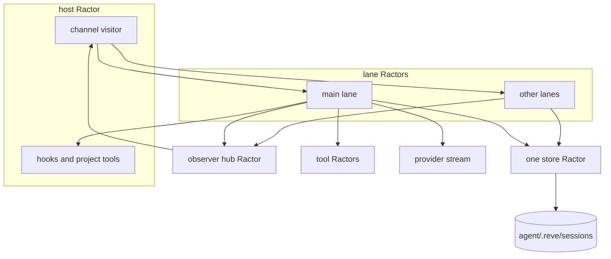

# Reve

Reve is a durable coding agent in Ruby on Ractors. Model-authored commands always run in
a microsandbox microVM through the mandatory `microsandbox-rb` gem. The defining rule is
simple:

> **The folder is the agent.**

There is no machine-wide Reve profile, no home-directory prompt, no global model file, and
no session store outside the agent folder. Copy the folder and you copy the agent: its
identity, instructions, model configuration, skills, tools, workspace, channel example,
and durable history.

## Start with an agent folder

```text
reve/                         the agent root
├── instructions.md            identity, purpose, and standing instructions
├── models.yml                 provider and model configuration owned by this agent
├── agent.rb                   executable configuration DSL (`./agent.rb` launches Reve)
├── channels/
│   └── tui.rb                 the one shipped channel, a small visitor adapter
├── tools/
│   └── example.rb             optional project tools written in Ruby
├── sandbox.rb                 optional sandbox policy
├── workspace/                 the VM-visible, agent-editable mind and worktree
│   ├── AGENTS.md              abbreviated stateful-agent kernel
│   ├── SOUL.md                identity, voice, boundaries, and timezone
│   ├── KNOWLEDGE.md           index into knowledge/
│   ├── DREAM.md               memory-consolidation protocol
│   ├── HEARTBEAT.yml          dynamically reloaded background task schedule
│   ├── knowledge/             mutable durable facts
│   ├── notes/                 append-only daily narrative
│   └── skills/                all skills, including heartbeat authoring guidance
└── .reve/
    ├── sessions/              JSONL durable session logs
    └── logs/                  oversized tool output
```

Create the complete structure in the directory you are in:

```bash
bin/reve init .
bundle install
bundle exec bin/reve
```

`reve init` is idempotent. It never writes to `$HOME`, a global cache, or another
project. `models.yml` is copied into the new root and becomes the only model configuration
that this agent reads. The generated `channels/tui.rb` is intentionally small enough to
serve as a channel implementation example.

The launcher refuses to run in a directory that is not an agent. This prevents an agent
from silently attaching itself to an arbitrary checkout. The only durable paths are under
the agent root, and `--session` is rejected when it points outside `.reve/sessions`.
Launching `reve` reopens the named `main` conversation by default (adopting the newest
legacy session on first use). `reve -c research` opens another persistent named
conversation. Use `/new` to rotate the selected conversation to a fresh durable session
without rebooting the microVM.

## The one channel: inline TUI

Reve deliberately implements exactly one channel: the terminal UI. It does not use an
alternate screen buffer. Output stays in normal terminal scrollback, while one owned input
line is hidden, printed above, and redrawn after every event. This keeps command history,
copy/paste, and terminal scrollback useful.

The library renderer is `Reve::InteractiveAgentTUI`. The generated `channels/tui.rb` is a
visitor adapter, not a second renderer:

```ruby
module Reve
  module Channels
    class TUI
      def initialize(harness, suspended, lane: "main")
        @renderer = Reve::InteractiveAgentTUI.new(harness, suspended, lane: lane)
      end

      def visit(event) = @renderer.render(event)
      def run = @renderer.run
      def submit(text) = @renderer.submit(text)
    end
  end
end
```

That is the whole channel boundary. It delegates to high-level harness operations and
visits observer events. A future channel would implement the same small handoff without
changing storage, lanes, providers, or tools.

The host Ractor owns the terminal entry box and renderer. Lane Ractors own durable work.
Input is translated into lane messages; rendering consumes the observer stream:



Useful commands include:

```text
/help                 command reference
/steer <text>         queue guidance at the next checkpoint
/next <text>          queue text for the next run
/followup <text>      add a follow-up while work is active
/abort                abort and durably reconcile the current operation
/resume               resume a suspended operation
/compact [instr]      compact the current branch, optionally with summary instructions
/new                  create and switch to a fresh durable session
/model [spec]         inspect or select the local models.yml model
/lanes                inspect lane state
```

## Background heartbeats

`workspace/HEARTBEAT.yml` declares periodic tasks that run in unattached durable lanes
while the `main` conversation is open. Reve fingerprints and reloads the file every
scheduler scan. Each task selects a model and lane, chooses whether to continue that
lane, and may run a `vm-exec` prerequisite. A nonzero prerequisite skips the model turn
and is logged. Host execution is deliberately unsupported.

The model must return exactly `SILENCE`, `Message: one paragraph`, or `Steer: command`.
Messages and steering are durably queued into main; malformed output is reported as a
heartbeat error. Before each run, Reve refreshes
`workspace/RECENT_CONVERSATIONS.md` from a bounded tail of main's durable context, so
`DREAM.md` can consolidate recent work without mounting `.reve/` in the VM. The generated
`heartbeat` skill documents every option.

## Durable architecture

Every mutation follows the same sequence: record intent, perform the effect, then append
the result with the identifiers named by the intent. A crash leaves either a completed
operation or enough information for recovery to finish it. Records are metadata; entries
are the conversation tree.



The store is the single writer for one session. JSON strings and `Ractor::Port`s are the
only values crossing Ractor boundaries. A tool call is isolated in its own Ractor unless a
project tool or sandbox connection must remain in the host Ractor. Lanes serialize their
own operation, queue, abort, retry, compaction, and recovery state.

## Mandatory sandbox and dynamic skills

Reve depends on `microsandbox-rb`. There is no local mode, CLI transport, Fiddle fallback,
or host shell: if the gem or embedded runtime cannot boot the configured VM, Reve refuses
to start. Model `bash`, project `ctx.sh`, and user `!command` all execute through the same
live VM handle. `workspace/` is the only writable bind mount; host-side file helpers are
strictly confined to that bind source, including symlink resolution. GitHub hosts are
allowed by default, but credentials are never borrowed implicitly. `allow ... do;
secret ...; end` explicitly scopes placeholder substitution to named hosts.

The first launch creates and provisions a VM. Clean shutdown stops it but preserves its
root disk and definition; later launches restart that named VM instead of reinstalling
APT and language tools. Node is installed through mise; ast-grep uses npm because mise's
aqua backend still queries GitHub's unauthenticated, rate-limited releases API. A sandbox policy or toolchain change
intentionally replaces and reprovisions it. Before the TUI appears, a live startup spinner
names image/VM creation, APT/mise provisioning, and each bootstrap stage, then reports
elapsed time. Reve also avoids model-endpoint discovery during startup.

At every run boundary Reve rereads full `workspace/AGENTS.md`, full
`workspace/SOUL.md`, and the first 100 lines of `workspace/KNOWLEDGE.md`. They enter the
durable turn context rather than the stable system prefix, so edits apply immediately
without destroying prompt-cache continuity across tool steps.

All skills live in VM-editable `workspace/skills/` and are fingerprinted at each turn
boundary. When any file there changes,
Reve reloads the catalog and prepends an `<available_skills_update>` to the new user turn.
This exposes newly created skills to modern models without rewriting the system prompt and
invalidating its cached prefix.

For the same reason, Reve watches provider cache usage. A normal request with more than
30% uncached input emits a visible cache-miss warning. The first request in a session and
compaction requests are exempt because their cold prefixes are expected.

## Local configuration

`models.yml` is YAML and belongs to the agent root. Environment references require an
explicit `$`: for example, `baseUrl: $LLAMA_CPP_BASE` and `apiKey: $LLAMA_API_KEY`.
Every `apiKey` in YAML must be a `$ENV_VAR` reference; literal and bare-name API keys are
rejected. Generated agents default to `openai/gpt-5.6-luna`, and OpenAI is active in the
template. `/model` and its autocomplete refresh each configured endpoint through
`<baseUrl>/models`, parsing OpenAI `data` arrays and common `models` arrays without
hardcoded model ids. Discovery failures are printed with provider, URL, HTTP status, and
the complete response body; static declarations remain available. Provider request
configuration errors are returned in-band with provider/model and resolved environment
context rather than faulting a lane. No model file is read from `$HOME` or from a global
Reve directory.

The project uses `openai-responses`, `anthropic-messages`, and a scripted `fake` provider
for deterministic tests. Provider-specific differences live in each provider's `compat`
block rather than in scattered conditionals.

## Durable records

Sessions are append-only JSONL under `.reve/sessions/`:

```jsonl
{"kind":"header","version":4,"id":"...","cwd":"workspace"}
{"kind":"record","type":"operation_started","lane":"main","intent":{"kind":"run"}}
{"kind":"entry","lane":"main","type":"message","message":{"role":"user"}}
{"kind":"record","type":"tool_started","resultEntryId":"e_...","replay":"never"}
{"kind":"entry","lane":"main","type":"message","message":{"role":"toolResult"}}
{"kind":"record","type":"operation_finished","outcome":"completed"}
```

Recovery is tested against real child-process termination. Tool intent records provision
result IDs before effects. Safe tools may be replayed only when both the recorded and
current declarations say `safe`; effectful tools receive a synthetic interrupted result.

## Development

```bash
bin/test                 # every test file in its own process
rake lint                # syntax-check the project
rake test                # run the complete suite
rake rbs                 # validate signatures when RBS is available
bin/reve --version
```

The repository itself is also an ordinary Reve agent folder for development purposes.
Tests create isolated temporary agent folders and fake providers; they do not consult a
user profile or write persistent state outside their fixture folder.
